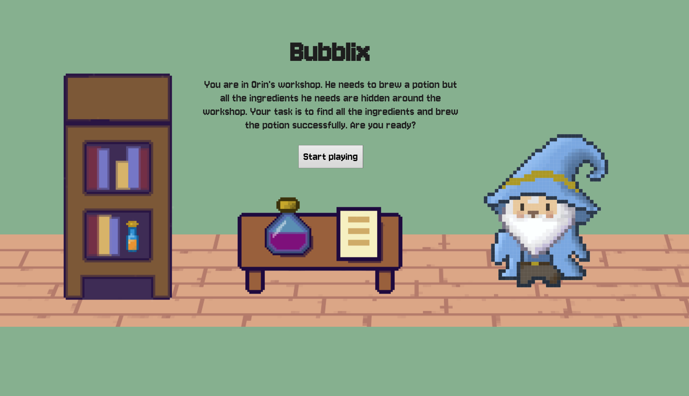
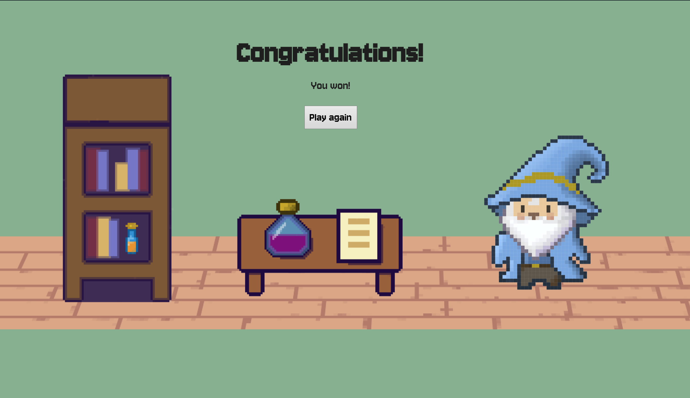
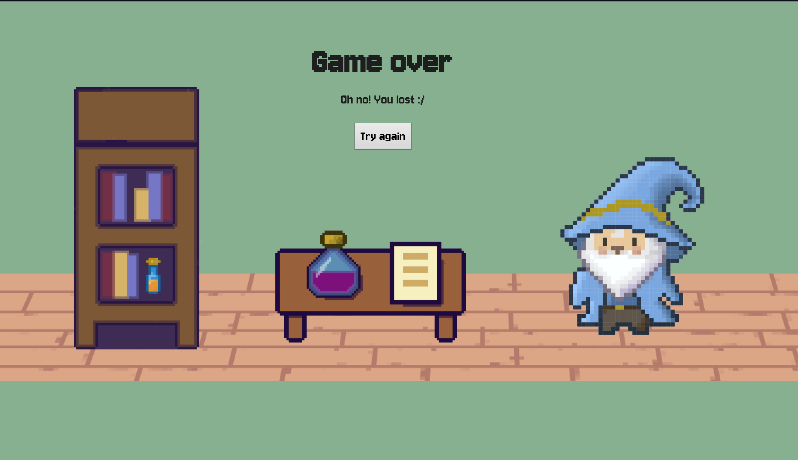
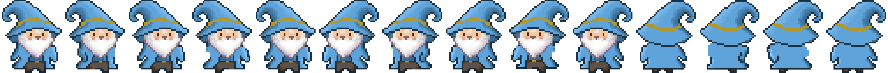
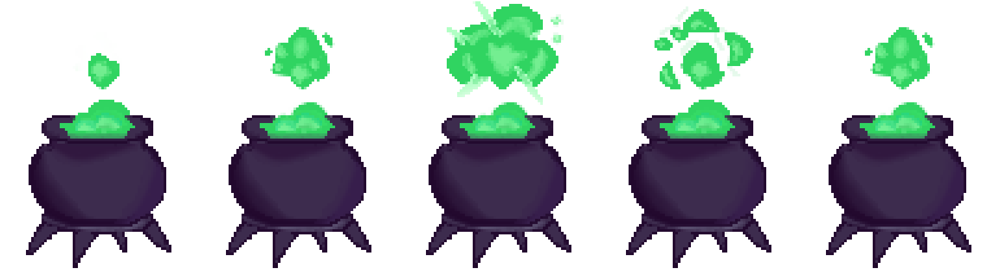

# Bubblix
Welcome to Orin's Workshop! Orin, the wizard, needs to brew a powerful potion, but his ingredients are missing! Your task is to help Orin find all the hidden ingredients scattered throughout the workshop. Each ingredient has been cleverly hidden, but don't worry — you'll receive hints that will guide you to their locations. Move around Orin's workshop to search for the hidden ingredients. Pay attention to the hints that will lead you to the correct spot. Every ingredient has a corresponding hint. If you think you've found the location where an ingredient is hidden, go to that spot. Once you find the ingredient, the next hint will appear to guide you to the next one. Find all of Orin's ingredients and help him brew the potion! Good luck on your magical adventure!

# Screenshots
## Main Gameplay:

*Figure 1: Collecting Hint for ingredients.*

## Menu and UI:

*Figure 2: Starting UI Screenshot.*

*Figure 3: Winning UI Screenshot.*

*Figure 4: Losing UI Screenshot.*

# Spritesheets
Below are the sprites used to create characters and objects in the game:

## Player Character:

*Figure 5: Player character animations.*

## Other Spritesheets:

*Figure 6: Cauldron animations.*

# Reflection
## What went well:
Creative Design: Creating a warm and friendly atmosphere was a lot of fun.
## Challenges:
Time Constraints:  The limited time was definetly a factor.
Scoring System: Creating a scoring system that would only reward the player after collectiong all the ingredients.
## Lessons Learned:
Going step by step: Taking one challenge at a time.
Feedback: Asking for feedback from the peers was really helpful.